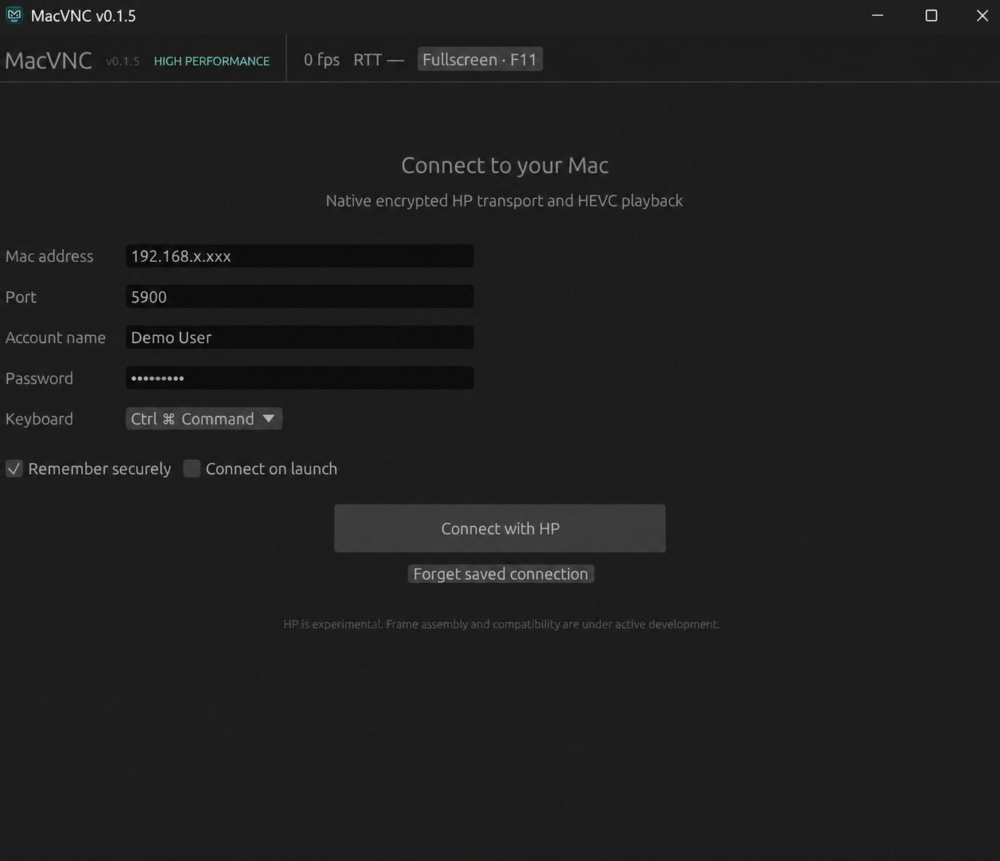

# MacVNC v0.1.6 — native Rust HP client

Developed by [AnchorSprint](https://anchorsprint.com).

Commercial and enterprise customization enquiries:
[oss@anchorsprint.com](mailto:oss@anchorsprint.com).
See [licensing](LICENSING.md) for current terms and the proposed source-available
model; the proposed usage limits do not override existing AGPL/MIT rights.

A native Windows desktop client for the Mac's built-in High Performance Screen
Sharing. The application, UI, input handling, authentication, encrypted control
channel, SRTP and packet assembly are Rust. HEVC decoding uses native FFmpeg 7
shared libraries; there is no Electron, browser, Node or Python runtime in the
Rust package.

## Platform support

The supported native package runs on **Windows x64** and controls a Mac running
macOS Screen Sharing. A native macOS controller build is not available yet, so
Mac-to-Mac control through MacVNC is currently unsupported. On two Macs, use
Apple's built-in **Screen Sharing** app (Finder → Go → Connect to Server →
`vnc://<mac-address>`) or Remote Management instead.

**Status: experimental native build.** Live 1080p validation covers authentication,
decoding and missing-reference recovery.
An idle login-screen black-picture issue is still under investigation; reconnecting
currently restores the picture in the reported case.
A language rewrite alone does not prove better FPS. Hardware HEVC acceleration is not currently enabled; the native
software decoder uses slice threading for Apple's HEVC 4:4:4 stream.

## Install without building (Windows x64)

Download the latest **native Rust HP** package from [GitHub Releases](https://github.com/ossmalaysia/macvnc/releases/latest), extract the ZIP, and run `macvnc-app.exe`. Keep every DLL beside the executable. The package is portable and does not require Node, Rust, Electron, or an installer.

Releases are unsigned, so Windows SmartScreen may require explicit approval. Verify `SHA256SUMS.txt` before launching a downloaded package.

## What it looks like

The connection screen keeps setup focused and shows the active HP mode, FPS,
latency, secure credential storage, and keyboard shortcut profile.



## Build and run from source (Windows x64)

Install stable Rust using rustup and Visual Studio C++ build tools with the
Windows SDK, then:

```powershell
cargo test --workspace
powershell -File scripts/build-rust.ps1 -Package
.\dist\macvnc-rust\macvnc-app.exe
```

The packaging script downloads a pinned, checksum-verified FFmpeg 7 LGPL shared
build. Keep its DLLs beside the executable. `dist/macvnc-rust` is the portable
package; it includes codec license/source notices. No Node installation is needed.
For development, set `MACVNC_FFMPEG_DIR` to the directory containing
`avcodec-61.dll`, `avutil-59.dll`, `swresample-5.dll`, and `swscale-8.dll` before
`cargo run -p macvnc-app`.

## Connect

The toolbar shows presented FPS and network round-trip latency (`RTT`, in ms).
On Windows, RTT comes from the OS estimate for the existing TCP connection,
read once per second without extra probes; it may stay unchanged while idle.
It does not measure video
decode, display or input-to-screen delay. `RTT —` means unavailable.

Enable Screen Sharing on an Apple-Silicon Mac running macOS Sonoma 14 or later.
Use the Mac address, port 5900 and an allowed macOS account. HP uses TCP 5900 and
UDP media; use a trusted, low-latency network. It can create a virtual display and
change the Mac's display/session behavior.

The Rust app imports the existing macvnc saved profile locally where Windows
DPAPI permits it. New profiles use DPAPI and never serialize the plaintext
password. The encrypted secret binds the destination and account; editing those
fields invalidates reuse. Older saved passwords remain available but require
one explicit Connect after checking the Mac address, then saving upgrades them.
A missing/decryption-failed password disables auto-connect. Rejected
logins are never retried automatically. The Rust Forget action prevents importing
legacy credentials again without deleting the older app's files.

Click the remote picture to capture keyboard and pointer. F11 toggles fullscreen.
Drag the Windows title bar, app name, or empty header area to move the client.
Double-click the app header to maximize or restore the window.
The keyboard supports Ctrl-as-Command and Native profiles. Left/right modifiers
are combined by the current GUI input API, so the legacy right-Ctrl passthrough
is not yet equivalent. Clipboard transmission is supported; audio, file transfer
and hardware video decode are not implemented.

## Roadmap

- [ ] Replace unmaintained transitive `paste` and `ttf-parser` dependencies through
  compatible upstream upgrades; see the dependency notes in [SECURITY.md](SECURITY.md).

- [ ] **Remote audio playback:** play the Mac's system audio through the Windows
  client, including YouTube on the Mac mini. Currently the client sends an audio
  heartbeat to maintain the HP session but does not decode or play received audio.
  Add authenticated audio reception, decoding, bounded playback buffering,
  audio/video synchronization, and mute/volume controls. Validate audible YouTube
  playback, synchronization, and clean audio shutdown/restart on disconnect and
  reconnect using an authorized live session.

## Architecture

| Crate | Responsibility |
|---|---|
| `hp-protocol` | Apple type-30 authentication, chained encrypted control records, HP offer/answer and input messages |
| `hp-media` | SRTP authentication/replay checks, RTP/FU assembly, shared HEVC decoder and negotiated-size compositing |
| `macvnc-app` | Native egui UI, OS credential storage, session lifecycle and bounded latest-frame delivery |

The HP offer requests one complete HEVC picture per frame. Multi-tile offers
produced visible corruption in live testing and are not the default. The media
layer retains band-compositing support and crops to negotiated display dimensions.
The UI displays a rolling count of frame submissions, excluding idle redraws;
this is not a measurement of the monitor's actual scanout or input latency.

## Validation

```powershell
cargo fmt --all --check
cargo test --workspace
cargo clippy --workspace --all-targets -- -D warnings
cargo test -p hp-media --test native_decode -- --ignored
cargo run -p macvnc-app -- --smoke-ui
```

The native decoder test requires the FFmpeg DLL directory above and uses an
included synthetic HEVC image. Live validation uses only a configured, authorized
Mac; do not store desktop captures or credentials in the repository.

For an authorized saved profile, `macvnc-app.exe --live-smoke 120
--simulate-video-loss --report <path>` checks recovery after deliberately omitting
one authenticated video fragment. `MACVNC_DIAGNOSTICS_PATH` optionally writes
aggregate counters every five seconds; it never includes credentials or pictures.

## Legacy reference

For contributions and safe bug reports, see [CONTRIBUTING.md](CONTRIBUTING.md).

Native validation uses the Rust workspace commands above.

See [AGENTS.md](AGENTS.md), [Rust guidance](rust/AGENTS.md) and
[SECURITY.md](SECURITY.md). The original MIT license is retained; the native HP crates and
the combined native executable are supplied under AGPL-3.0-or-later. FFmpeg and
other dependencies retain their own licenses. See [licenses and provenance](docs/THIRD_PARTY.md).
